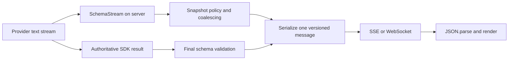

# Streaming JSON over fetch, SSE, and WebSocket

SchemaStream is a parser, not a transport. Fetch streams, Server-Sent Events (SSE), and WebSockets
move bytes or messages; none of them turns an arbitrary model-text chunk into a complete JSON
document. Keep transport framing separate from JSON parsing and application validation.

Every snapshot yielded by `SchemaStream.iterate()` is an independent, JSON-equivalent value. It
can be serialized and sent as one valid JSON message even while the source document is incomplete.
The snapshot is not automatically schema-valid or trusted. Validate the settled result, or a
completed subtree, before using it for durable state or side effects.

## What each layer guarantees

| Layer | Boundary it guarantees | What it does not guarantee |
| --- | --- | --- |
| Fetch response body | Ordered byte chunks | A chunk may split UTF-8, a token, or any JSON value |
| SSE | Complete SSE events after the SSE stream is decoded | An event's `data` is not necessarily the target JSON document |
| WebSocket | Ordered application messages on one connection | A message is valid JSON only when the sender makes it so |
| SchemaStream snapshot | A complete, independent JSON-equivalent value | Schema validation, authorization, or business-rule validity |

Provider SDKs often add another envelope around model text. Decode that envelope first and pass
only the ordered text deltas to SchemaStream. For example, do not concatenate an entire SSE event,
including `event:` and `data:` fields, into the JSON being parsed.

## Raw chunks are not application messages

The word *stream* hides three different browser contracts:

1. A raw Fetch response body exposes arbitrary byte chunks. One server write can arrive in several
   reads, and several writes can arrive in one read. A read is not a UTF-8, JSON-token, or JSON-value
   boundary.
2. `EventSource` decodes an SSE response line by line, accumulates its `data:` fields, and dispatches
   one `MessageEvent` only after the blank-line event delimiter. Network fragmentation is not visible
   as several browser events.
3. WebSocket preserves logical message boundaries. A message can use several protocol frames or TCP
   packets, but the browser dispatches one `message` event after the protocol reassembles it.

This distinction corrects a common misconception: SSE can carry a complete server-materialized JSON
snapshot. Put one compact `JSON.stringify()` result in one SSE event, and `event.data` is the complete
JSON text even when the underlying response arrived in many network reads. The same snapshot can be
one WebSocket message:

```typescript
const message = {
  type: "snapshot",
  revision: revision++,
  value: snapshot
}
const payload = JSON.stringify(message)

// SSE: the blank line terminates one application event.
controller.enqueue(encoder.encode(`id: ${message.revision}\ndata: ${payload}\n\n`))

// WebSocket: send() creates one logical application message.
socket.send(payload)
```

The corresponding browser handlers both parse complete JSON:

```typescript
events.onmessage = event => render(JSON.parse(event.data))
socket.onmessage = event => render(JSON.parse(String(event.data)))
```

Browser-side partial JSON parsing is necessary only when the server forwards raw model deltas or an
otherwise unframed response body *and* the UI must derive progressive structured snapshots from it.
A browser that renders raw text or waits for the final document does not need a partial JSON parser.
A raw Fetch stream can still carry complete snapshots, but it needs an explicit record protocol such
as NDJSON, JSON text sequences, or length-prefixed messages. The browser must buffer that framing
across arbitrary response chunks before calling `JSON.parse`.

The provider hop and browser hop are separate decisions. A provider may force SSE or another streamed
protocol into the server. Once the server extracts the ordered model text, it can terminate that
protocol, run SchemaStream, and choose a different application transport for its own browser.

## Why repeated accumulation is weak

A common browser implementation retries `JSON.parse` after every chunk:

```typescript
let text = ""

for await (const chunk of source) {
  text += chunk

  try {
    render(JSON.parse(text))
  } catch {
    // Most prefixes are not complete JSON documents.
  }
}
```

Most attempts fail until the document closes. Each retry starts at the beginning, and repeated
string concatenation, scanning, exceptions, and object construction add work to the rendering
path. With fixed-size chunks, rescanning a response that grows from 1 to _n_ bytes can approach
quadratic cumulative work.

SchemaStream keeps incremental parser state across chunks. That avoids reparsing the complete
prefix on every update, but snapshots still have a cost. Materializing, serializing, and sending a
growing full snapshot on every tiny source chunk can also approach quadratic cumulative bytes.

## Recommended server boundary

For most provider-backed applications, parse once on the server and send complete application
messages to the UI:



A useful wire envelope separates progress from the final validated result:

```typescript
type SnapshotMessage<T> = {
  type: "snapshot"
  generationId: string
  revision: number
  final: boolean
  value: T
}
```

The server should:

1. Extract the provider's ordered JSON text stream.
2. Feed it to `iterate()` with a suitable [snapshot policy](./snapshot-policies.md).
3. Keep only the latest pending snapshot and flush at a bounded UI cadence.
4. Serialize each flushed envelope once, then reuse that string for every subscribed client.
5. Drop superseded progress revisions when a client is behind instead of building an unbounded
   send queue.
6. Validate the authoritative final SDK result and always send a final revision.

The browser receives a whole message and follows a simple contract:

```typescript
let latestRevision = -1

socket.addEventListener("message", event => {
  const message = JSON.parse(String(event.data)) as SnapshotMessage<unknown>

  if (message.revision <= latestRevision) {
    return
  }

  latestRevision = message.revision
  render(message.value)
})
```

`JSON.parse` now succeeds for every accepted application message. The browser does not need to
understand provider event shapes, token boundaries, schema placeholders, or partial JSON syntax.
The repository's `examples/websocket-ui/` visualization demonstrates complete messages and policy
cadence, but intentionally sends every selected emission on localhost. It does not implement the
production coalescing, replay, or socket-backpressure controls above.

## Choose the transport for the application

| Browser transport | Browser framing work | Client-to-server controls | Reconnect and replay | Best fit |
| --- | --- | --- | --- | --- |
| Raw Fetch plus NDJSON or another record format | Buffer and decode records across arbitrary chunks | Request body and headers initially; a new request for later commands | Application-defined | One request-scoped generation, especially when custom request headers or a body matter |
| SSE through `EventSource` | Built-in SSE event parsing | A separate HTTP request | Automatic reconnect and `Last-Event-ID`; server-defined replay | One-way progress and notifications |
| WebSocket | Built-in logical message parsing | The same full-duplex connection | Application-defined | Interactive generation, cancellation, acknowledgements, subscriptions, or multiplexing |
| Raw provider stream plus browser-side SchemaStream | Incremental provider JSON parsing | Depends on the provider transport | Application-defined | Local-first or offline sources with no server secret |

Large documents are a separate concern. Whichever transport is selected, prefer throttled patches or
completion events plus one authoritative final snapshot when repeated full objects dominate network
and browser parse cost.

## Steelman: why WebSocket often wins here

For an interactive provider-backed interface, the case for WebSocket is strong:

- The API credential, provider SDK, `AbortController`, and SchemaStream already belong on the server.
- One serialized snapshot envelope maps directly to one WebSocket message. The browser only rejects
  stale revisions, runs `JSON.parse`, and renders.
- Start, cancel, restart, snapshot-policy changes, acknowledgements, and subscriptions can use the
  same connection as progress messages.
- The server parses the provider output once instead of making every browser bundle and run an
  incremental parser or understand provider-specific event envelopes.
- In a Bun server that already handles HTTP, the WebSocket upgrade and message handler are small. The
  repository example demonstrates the complete flow rather than only a transport fragment.

For that shape of application, WebSocket is often simpler than an SSE connection plus separate
`POST` or `DELETE` endpoints for commands. The argument is about one bidirectional application
protocol, not about WebSocket being the only way to preserve JSON boundaries.

The browser control path stays small:

```typescript
const socket = new WebSocket("wss://app.example/runs")

socket.addEventListener("message", handleVersionedMessage)
socket.addEventListener("open", () => {
  socket.send(JSON.stringify({ type: "start", prompt, snapshotPolicy }))
})

function cancel() {
  if (socket.readyState === WebSocket.OPEN) {
    socket.send(JSON.stringify({ type: "cancel" }))
  }
}
```

An SSE design can be equally correct, but usually splits that flow across a request that creates the
run, an `EventSource` that receives progress, and another request that cancels it. Whether one socket
or several HTTP endpoints are simpler depends on the rest of the application's protocol.

## Adversarial review

The strongest counterargument is that SSE already solves downstream framing. A server can run
SchemaStream and put each complete snapshot in one SSE event. `EventSource` also supplies automatic
reconnection and sends `Last-Event-ID`, which can make one-way progress and replay simpler than a
custom WebSocket resume protocol. Infrequent cancellation can use a separate HTTP request.

WebSocket does not remove lifecycle work:

- The provider request still needs an abort signal. A cancel message or closed socket must be wired to
  it explicitly when no authorized consumer remains.
- The standard browser `WebSocket` API has no incoming backpressure mechanism. Servers must bound
  outbound queues, coalesce superseded snapshots, and drop progress rather than final state when a
  client falls behind.
- Reconnect, authentication, authorization, replay, heartbeat policy, stale-revision rejection, and
  multi-instance connection routing remain application concerns.
- Browser WebSocket and native `EventSource` do not accept arbitrary application headers. Use an
  intentional same-origin session or capability design, validate WebSocket `Origin`, and avoid
  putting long-lived credentials in URLs.
- Sending a growing full snapshot at token cadence can approach quadratic cumulative bytes and
  repeated browser `JSON.parse` work over SSE, WebSocket, or framed Fetch alike.

Native `EventSource` also lacks an application demand signal, so high-rate SSE publishers need the
same bounded cadence and superseded-progress policy. Intermediaries can also buffer
`text/event-stream` responses or terminate idle ones, delaying an otherwise correct event. Production
SSE needs prompt flushing, appropriate content and cache headers, infrastructure-specific buffering
configuration, and often comment heartbeats. The
[HTML standard authoring notes](https://html.spec.whatwg.org/multipage/server-sent-events.html#parsing-an-event-stream)
specifically warn that block buffering can delay event dispatch.

Fetch `ReadableStream` exposes Web Streams cancellation and queue or pipe backpressure more directly.
That signal does not guarantee immediate end-to-end propagation through browser, network, or
provider buffers. These APIs are not evidence that streams are architecturally wrong; they make
lifecycle work explicit. WebSocket shifts that work into message queues, close handling, and the
application's reconnect protocol rather than removing it.

Raw Fetch is also viable when ordinary request semantics matter. It can send a request body and
custom headers, then return NDJSON or another framed snapshot protocol. Its cost is a small browser
record decoder and application-defined reconnection, not necessarily a partial JSON parser.

The weak claim to avoid is "SSE breaks JSON boundaries, therefore only WebSocket works." The equally
weak opposite is "WebSocket is needless complexity." Parse provider deltas once on the server and
emit complete, versioned application messages. Prefer WebSocket when the workflow is genuinely
bidirectional. Prefer SSE when progress is one-way and its reconnect model is valuable.

## Control cumulative cost

Start with `snapshotPolicy: { mode: "value" }` when incomplete long strings would otherwise cause
many near-identical updates. Use a byte policy when payload volume is a better cadence signal:

```typescript
for await (const snapshot of parser.iterate(source, {
  snapshotPolicy: { mode: "value" }
})) {
  queueLatestSnapshot(snapshot)
}
```

Then add application-level controls based on the UI and network:

- Coalesce updates to a bounded rendering rate, such as 10 to 20 updates per second.
- Send only the newest pending revision when transport backpressure or queue depth grows.
- Serialize once per revision, not once per connected client.
- Use path events or an application patch format for large objects that change in small regions.
- Send a complete final snapshot so reconnecting and late clients have a canonical state.
- Measure total bytes, serialization time, render time, and queue depth instead of only token
  latency.

Full snapshots are the simplest protocol and work well for modest outputs. If every revision is
nearly as large as the final document, patches can reduce network and parse cost. Patches add their
own requirements: ordering, base revisions, resynchronization, and a full-state fallback.

## Completion events and conditional work

`onValueComplete` is independent of snapshot cadence. It can mark a syntactically completed field
or subtree while snapshots are throttled:

```typescript
let reviewMode = false
const actionSchema = z.enum(["continue", "require-review"])

const parser = new SchemaStream(schema, {
  onValueComplete({ path, value }) {
    if (path.length === 2 && path[0] === "decision" && path[1] === "action") {
      const action = actionSchema.safeParse(value)
      reviewMode = !action.success || action.data === "require-review"
    }
  }
})
```

Keep the callback synchronous and cheap. The event value is syntactically complete but not
schema-validated; validate the relevant subtree before queuing consequential work. A completed JSON
path is a syntax milestone, not permission to perform a payment, database write, tool call, or
other side effect. Paths can also describe input fields that are absent from the declared schema.

Prefer `onValueComplete` for new listeners. Legacy `onKeyComplete` includes character progress and
a cumulative completion history, which costs more on large documents. See
[completion events](./completion-events.md) for ordering and callback semantics.

## Browser parsing is supported

Running SchemaStream in a browser is not inherently wrong. It is a reasonable choice when the
source already belongs in the browser, no provider secret is exposed, there is one consumer, and
the output is small enough for the target device. A Web Worker can keep heavier parsing and
materialization off the main rendering thread.

Server placement is usually preferred for provider-backed applications because it keeps API keys
private, parses once for multiple viewers, and centralizes validation, throttling, cancellation,
size limits, logging, and protocol translation. It also prevents every client from paying the same
incremental parsing cost.

Whichever boundary you choose:

- Authenticate subscriptions and authorize each generation.
- Enforce source-size, nesting, time, and output-rate limits.
- Treat progressive and final model output as untrusted data; render text as text, not HTML.
- Respect backpressure and cancel provider work when no authorized consumer remains.
- Distinguish JSON-valid progress from the schema-validated final result in the wire protocol.

The durable contract is simple: parse arbitrary provider chunks at one trusted boundary, control
snapshot cadence there, and give downstream consumers complete, versioned application messages.

## Standards and runtime references

- [Fetch body streams](https://fetch.spec.whatwg.org/#concept-body) and the
  [Streams model](https://streams.spec.whatwg.org/#model) define raw response chunks and
  queue or pipe backpressure.
- The [HTML SSE parsing algorithm](https://html.spec.whatwg.org/multipage/server-sent-events.html#event-stream-interpretation)
  defines event buffering, dispatch, reconnection, and `Last-Event-ID`.
- [RFC 6455 message fragmentation](https://www.rfc-editor.org/rfc/rfc6455.html#section-5.4)
  and the [WebSockets browser API](https://websockets.spec.whatwg.org/#feedback-from-the-protocol)
  distinguish protocol frames from browser-visible messages.
- [Bun's WebSocket backpressure documentation](https://bun.sh/docs/runtime/http/websockets#backpressure)
  defines the send status and `drain` hook used for production queue control.
